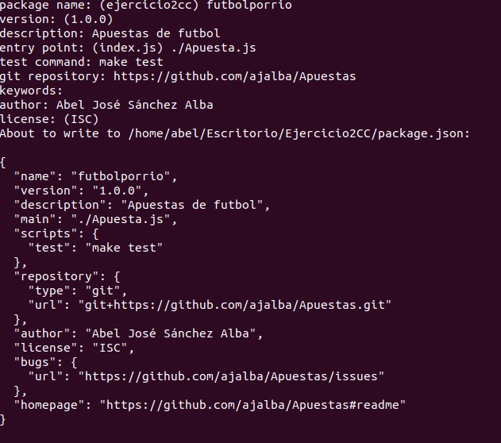
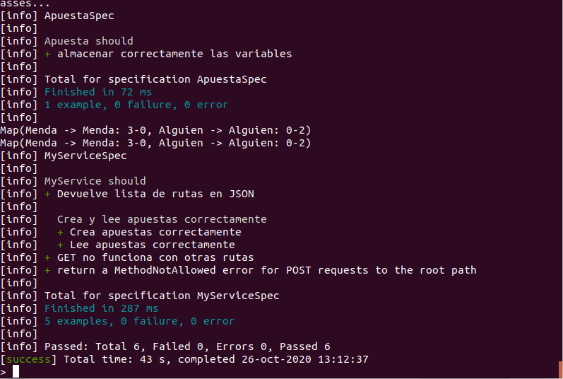
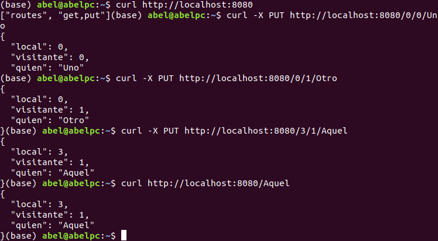
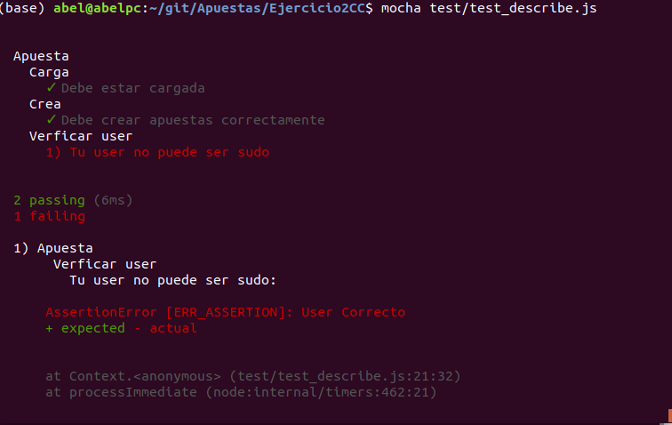

# Ejercicio 1
## Instalar alguno de los entornos virtuales de node.js (o de cualquier otro lenguaje con el que se esté familiarizado) y, con ellos, instalar la última versión existente, la versión minor más actual de la 4.x y lo mismo para la 0.11 o alguna impar (de desarrollo).

## Instalación
Para instalarlo basta con descargar el script  dado por (https://github.com/nvm-sh/nvm) y ejecutarlo o en su defecto emplear el comando *curl -o- https://raw.githubusercontent.com/nvm-sh/nvm/v0.36.0/install.sh | bash* que hará la instalación automática.

Por otro lado, para instalar la versión más reciente de node es recomendable emplear *nvm install node* ya que "node" es un alias para la última versión dispoble.

En el caso de a día 21 de Octubre de 2020, la versión 15.0.0

Para el resto de versiones bastará cambiar en el comando anterior la palabra **node** por el número de versión deseado.

# Ejercicio 2
## Crear una descripción del módulo usando package.json. En caso de que se trate de otro lenguaje, usar el método correspondiente.

Basta con crear una carpeta y ejecutar el comando `npm init` y así obtener toda la estructura de directorios básica necesaria para comenzar un proyecto, entre ellos un fichero **package.json**. Se puede observar la creación con los siguiente pasos en 

# Ejercicio 3
## Descargar el repositorio de ejemplo anterior, instalar las herramientas necesarias (principalmente Scala y sbt) y ejecutar el ejemplo desde sbt. Alternativamente, buscar otros marcos para REST en Scala tales como Finatra o Scalatra y probar los ejemplos que se incluyan en el repositorio.
Empleando Java 8, Scala y SBT
Se ha instalado sbt desde su página oficial (https://www.scala-sbt.org/download.html?_ga=2.121828747.1077410046.1603361923-1348640796.1603358470). 
Posteriormente se ha clonado el repositorio y seguidos los pasos de la sección *get started* del mismo.
`git clone git@github.com:JJ/spray-test.git my-project
cd my-project
sbt
`
Cuando se ejecuta `test` se obtiene como salida:

Posteriormente se ejecuta `re-start` y se ejecutan las comprobaciones dadas en el repositorio en otra terminal.

# Ejercicio 4
## Para la aplicación que se está haciendo, escribir una serie de aserciones y probar que efectivamente no fallan. Añadir tests para una nueva funcionalidad, probar que falla y escribir el código para que no lo haga. A continuación, ejecutarlos desde mocha (u otro módulo de test de alto nivel), usando descripciones del test y del grupo de test de forma correcta. Si hasta ahora no has subido el código que has venido realizando a GitHub, es el momento de hacerlo, porque lo vamos a necesitar un poco más adelante.

Se ha creado el fichero `Apuesta.js` con el siguiente contenido:

`exports.Apuesta = function(usuario, apuesta_resultado, cantidad_apuesta){
        this.usuario = usuario;
        this.apuesta_resultado = apuesta_resultado;
        this.cantidad_apuesta = cantidad_apuesta;
        this.as_string = as_string;
        this.get_usuario = get_usuario;
        this.get_resultado = get_resultado;
        this.get_cantidad = get_cantidad;
}
function as_string(){
        return this.usuario + ":" + this.apuesta_resultado + ":" + this.cantidad_apuesta;
}
function get_usuario(){
        return this.usuario;
}
function get_resultado(){
        return this.apuesta_resultado;
}
function get_cantidad(){
        return this.cantidad_apuesta;
}`
A continuación, tras instalar mocha se ha creado el fichero `test` dentro de la carpeta homónima, con el siguiente contenido:

`var apuesta = require("./Apuesta.js"),
assert= require("assert");
var nueva_apuesta = new apuesta.Apuesta('Abel','2-1','200');
assert(nueva_apuesta, "Creada apuesta");
assert.strictEqual(nueva_apuesta.as_string(), "Abel:2-1:200","Creado");
assert.notStrictEqual(nueva_apuesta.get_usuario(), 'sudo', "User correcto");
assert.strictEqual(nueva_apuesta.get_cantidad(), "200", "Cantidad tope de apuesta");
console.log("Todos los tests done");`

Y el fichero describe_test, con el siguiente contenido, donde se ha simulado un error, por ejemplo que el usuario se registre como *sudo*, el contenido del fichero es:
`var assert = require("assert"),
      apuesta = require("../Apuesta.js");

describe('Apuesta', function(){          
        describe('Carga', function(){           
                it('Debe estar cargada', function(){
                        assert(apuesta, "Cargado");
                });      
        });
                
        describe('Crea', function(){            
                it('Debe crear apuestas correctamente', function(){
                        var nueva_apuesta = new apuesta.Apuesta('Abel','2-1','200');
                        assert.strictEqual(nueva_apuesta.as_string(), 'Abel:2-1:200',"Creado");
                });     
        });

        describe('Verficar user', function(){
                it('Tu user no puede ser sudo', function(){
                        var nueva_apuesta = new apuesta.Apuesta('sudo','2-1', '1000');
                        assert.notStrictEqual(nueva_apuesta.get_usuario(),'sudo', "User Correcto");
                });
        });
});`

Donde se obtiene como salida  

